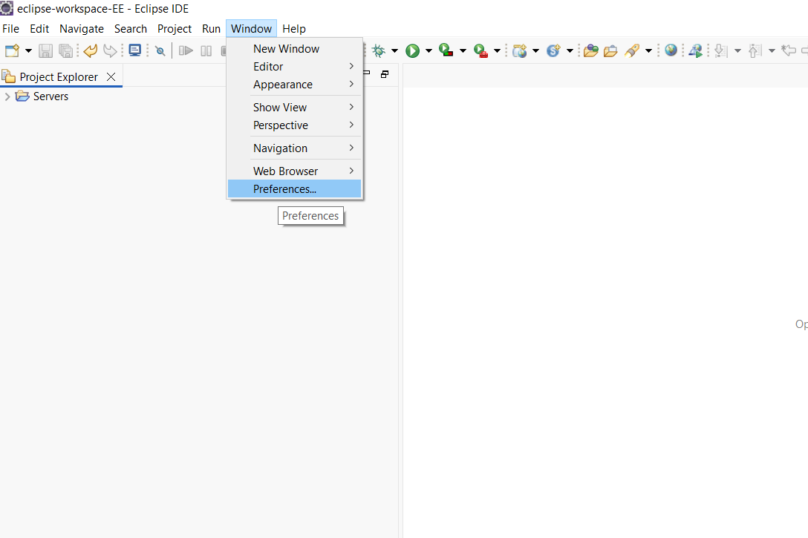
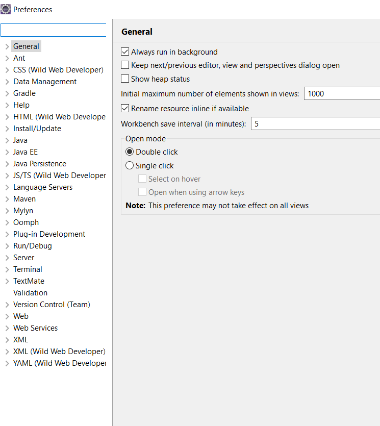
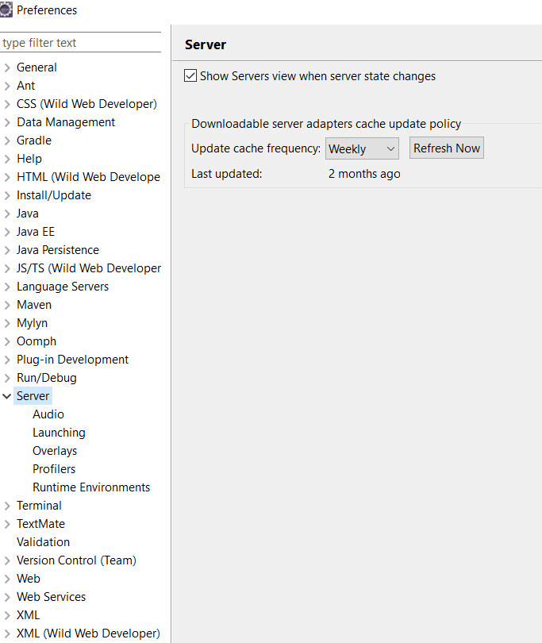
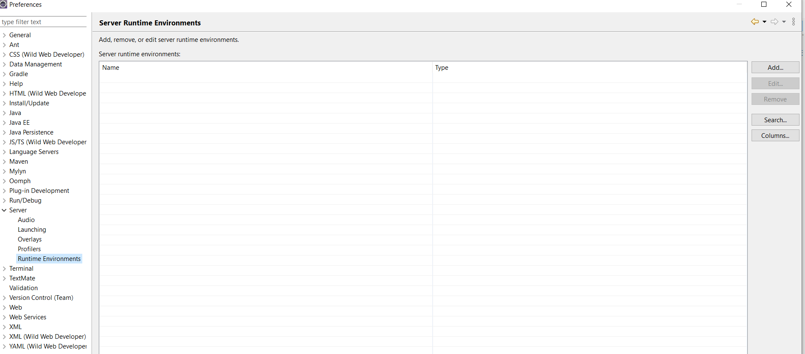
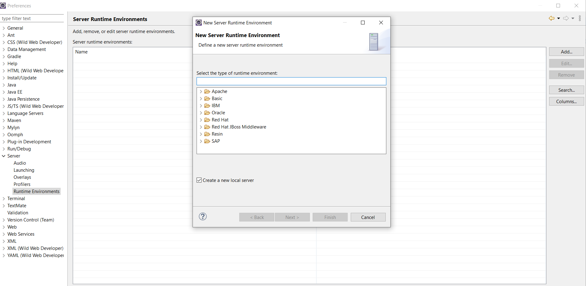
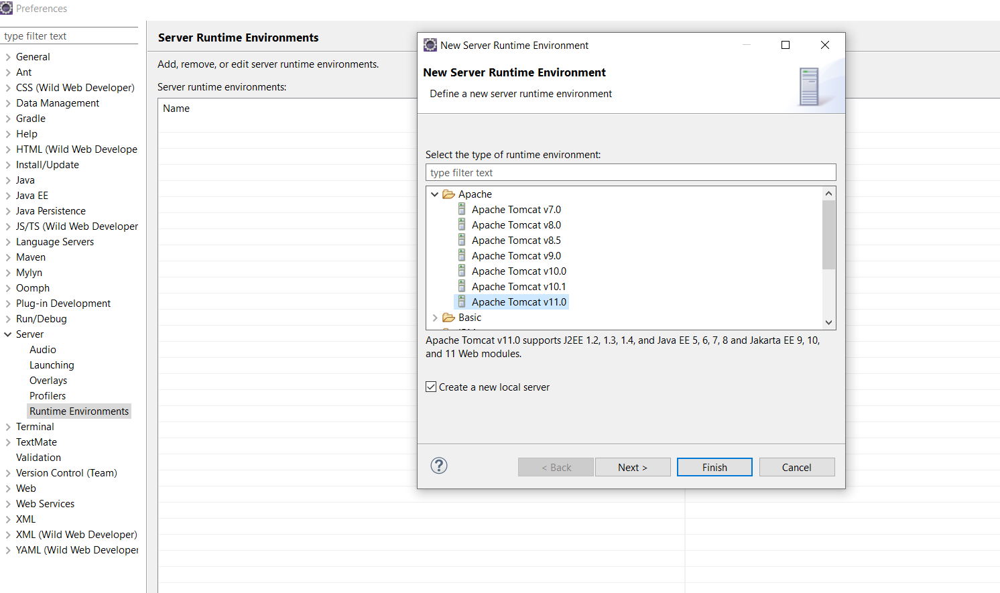
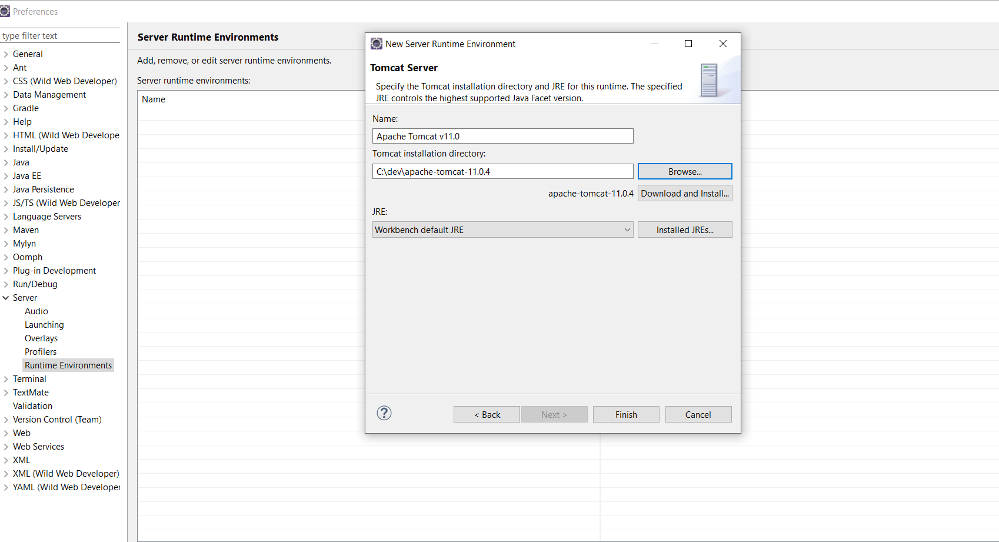
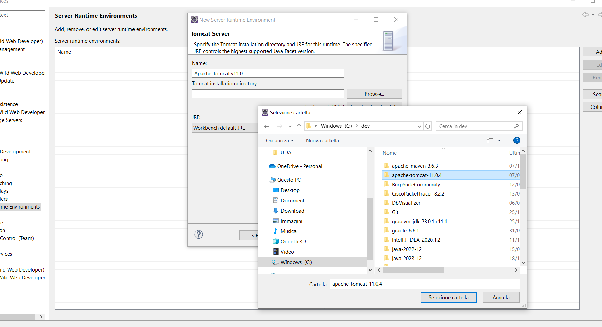
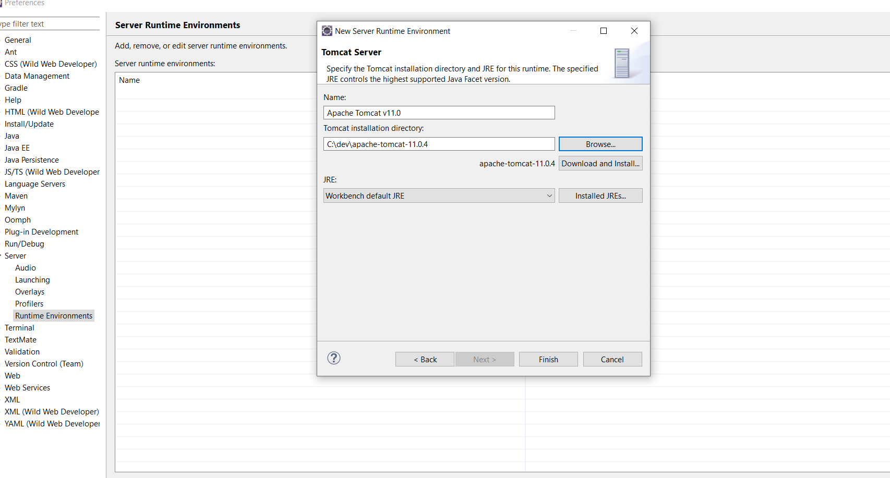
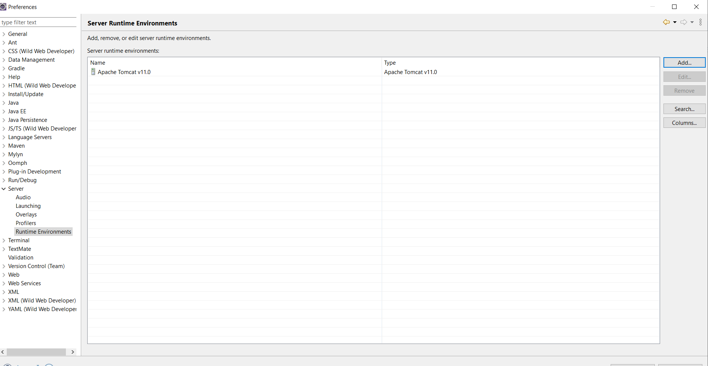

# Come aggiungere un server Tomcat in Eclipse

Per far si che da Eclispe possiamo sviluppare web application e testarle direttamente dobbiamo configurare Eclipse.

Ora procediamo con la configurazione vera e propria di Eclipse.

## Configurazione Eclipse

Prima però dobbiamo scaricare una versione di Tomcat, dal sito ufficiale sotto download https://tomcat.apache.org/.

Una volta scaricato il file di Tomcat è sufficiente
scompattarlo in una directory a vostra scelta.

Ad esempio sotto *c:\\dev* scompattiamo lo zip ottenendo *C:\dev\apache-tomcat-11.0.4*

In seguito quando configureremo Eclipse dovremo dare questo path per permettere di utilizzare Tomcat come runtime per sviluppare la Servlet e JSP.

Dal menù di Eclipse selezionare *Window* / *Preferences*

Si apre così la finestra generale di configurazione di Eclipse:

Selezioniamo la voce *Server*:

e selezioniamo l'opzione *Runtime Environments*:

Cliccando sul bottone *Add* è possibile aggiungere un nuovo *Runtime Environment*:

A questo punto selezioniamo sotto il gruppo Apache il server Tomcat (selezioniamo Tomcat 11, l'ultima vesione):

Cliccando sul pulsante *Next >* avccediamo alla finestra per selezionare, tramite il pulsante *Browse...*, la directory d'installazione del nostro Tomcat precedentemente installato sulla macchina locale (Nel nostro caso era stato installato sotto la directory *C:\\dev*) 

Cliccando quindi sul pulsante *Finish* abbiamo quindi aggiunto il servlet container *Tomcat* che ci serve per eseguire all'interno dell'IDE le Servlet e JSP.

