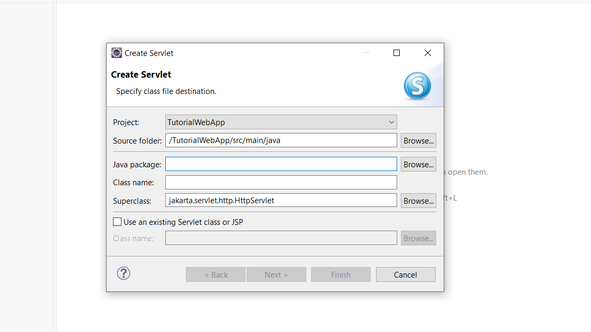

# Come creare una web app in Eclipse

E' necessario che prima sia stato configurato *Eclipse* aggiungendo un runtime di *Tomcat* per l'esecuzione delle Servlet e JSP. Vedi: 
* [Come configurare eclipse per sviluppare web app](./HOW_CONFIGURE_SERVER_IN_ECLIPSE.md)

## Creazione di TutorialWebApp 

Dal menù di *Eclipse* selezioniamo *File* / *New* / *Dynamic Web Project*:  


Nel campo *Project name* scriviamo *TutorialWebApp*, il nome che vogliamo dare alla nostra web app:  


Come *Context root* propone già *TutorialWebApp*:  


Ecco creato il progetto con la struttura per la web app:  


## Aggiunta di una servlet

A questo punto aggiungiamo una servlet che chiamimao *WellcomeServlet*: selezionando il progetto *TutorlaWebApp*, premendo il tasto destro, compare un menù; selezioniamo *New* / *Servlet*:  


Compare una finestra pre crare una servlet:  



In *Class name* inseriamo il nome della servlet, nel nostro caso *WellcomeServlet*:


Al termine dei varei step viene creato lo scheletro della servlet *WellcomeServlet*:  


## Esecuzione della web app

Selezionando il progetto *TutorlaWebApp*, premendo il tasto destro, compare un menù; selezioniamo *Run as* / *Run on Server*:


Ora possiamo accedere alla servlet digitando la seguente url nel browser:

http://localhost:8080/TutorialWebApp/WellcomeServlet

## Aggiunta di una JSP

Con una procedura molto simile aggiungiamo una JSP, *hello.jsp*.


http://localhost:8080/TutorialWebApp/hello.jsp

Aggiungiamo del codice Java per rendere un po' dinamico l'output della JSP:

```jsp
<%@ page language="java" contentType="text/html; charset=UTF-8"
    pageEncoding="UTF-8"%>
<!DOCTYPE html>
<html>
<head>
<meta charset="UTF-8">
<title>Insert title here</title>
</head>
<body>
<%= new java.util.Date() %>
</body>
</html>
```


